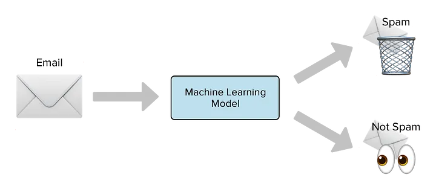

# Spam Message Detector Model 

## Objective

Thisproject presents a step-by-step guide to building an efficient e-mail spam classification model using the e-mail Spam Collection dataset. 

By the end of this project, you'll have a powerful tool to help you filter out unwanted e-mails and ensure that your inbox is not filled with unnecessary content.

## About the data
The dataset used for this project can be found [here](https://www.kaggle.com/datasets/mfaisalqureshi/spam-email) which consists of 5,574 messages with the following columns: 

1. "Category" column with the following labels:

    * HAM: real e-mails we want the filter to land our inbox
    * SPAM: spam/scam em-amils that we want to send directly to the spam folder

2. "Message" column with a list of messages without any type of format

## Methods Used

1. Punctuation removal 
    1. Remove urls, @users and numbers
    2. Remove every character that is not alphanumeric (like #)
    3. Lower every letter
    3. Delete extra whitespaces

2. Naive Bayes as base model.

## Technologies

- Docker

## Installation

build docker container 

docker build -t mlflow .

run docker container

docker run -p 5000:5000 -v $(pwd)/mlflow_artifacts:/mlflow/artifacts mlflow

## Metrics used

Precision: measures the accuracy of the positive predictions made by the model

Recall: measures the ability of the model to detect all the instances of the positive class

F1-score: combines precision and recall and it's useful when there is an imbalance between the classes (our case)

### Why not others?

Accuracy is the proportion of correct predictions (TPs & TNs) over all predictions. In an imbalanced dataset like ours where one class dominates, a model can achieve high accuracy by mostly predicting the majority class. However, this doesn't necessarily mean the model is performing well.

Choosing precision, recall and f1-score is better because they focus on the model's performance of the minority class too.

## Experimentation: 

1. Base model BOW + Multinomial Naive Bayes

Classification Report (Test):
              precision    recall  f1-score   support

           0       0.99      0.97      0.98       453
           1       0.82      0.95      0.88        63

    accuracy                           0.97       516
   macro avg       0.91      0.96      0.93       516
weighted avg       0.97      0.97      0.97       516

Recall 0.95: the model is detecting a 95% of the class 1
Precision 0.82: there is a significative number of False Positives
F1-score 0.88: decent value but since recall is high and precission not that much there is room for improvement.

## Conclusions

