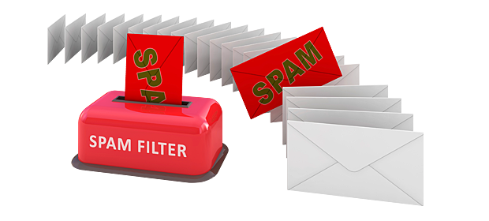

# Spam Message Detector Model 

## Objective

Thisproject presents a step-by-step guide to building an efficient e-mail spam classification model using the e-mail Spam Collection dataset. 

By the end of this project, you'll have a powerful tool to help you filter out unwanted e-mails and ensure that your inbox is not filled with unnecessary content.

## About the data
The dataset used for this project can be found [here](https://www.kaggle.com/datasets/mfaisalqureshi/spam-email) which consists of 5,574 messages with the following columns: 

1. "Category":

    * HAM: real e-mails we want the filter to land our inbox
    * SPAM: spam/scam em-amils that we want to send directly to the spam folder
2. Message:

List of messages without any type of format

## Technlogies

## Methods Used

## Installation

## Conclusions

