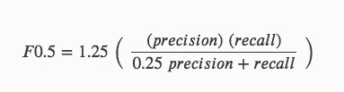
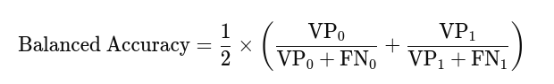

# Experimentation notebooks

Here you can find all the theory and explanations behind the experimentation part of this project. 

# Index
1. [Context](#Context) 
2. [Experiments](#Experiments)
  1. [Base-model BOW + Multinomial Naive Bayes](#Base-model-BOW-+-Multinomial-Naive-Bayes)
    - [BOW](#Bag-of-Words-as-Vectorizer) (theory)  
    - [Multinomial Naive Bayes](#Multinomial-Naive-Bayes) (theory)  
    - [Metrics used](#Metrics-used) (theory)
    - [Results](#Results) 🚧
  2. []
2. [SMOTE]
3. [Methods used](#Methods-used)

# Context

So let's dive in the logic behind a spam classifier for a bit. 

In the context of a binary classification problem like spam detection, the False Positives (FP) and False Negatives (FN) are crucial concepts for understanding the performance of your model. We have two tricky situations:

Situation A: a HAM email, like an important work-related message, is wrongly flagged as spam. This can be problematic because they cause legitimate messages to be missed. 

Situation B: a SPAM email is incorrectly categorized as legitimate, meaning it reaches the user's inbox. This can lead to users receiving unwanted or even harmful emails, such as phishing attempts, which can damage trust or cause security issues.

Trade-off between FP and FN: in spam detection, there's often a trade-off between false positives and false negatives. A model that minimizes false positives might allow more false negatives, and vice versa. In our case I decided that sending HAM e-mails to the SPAM inbox would be more problematic than the other way around. That's the reason behind using F0.5-score 

# Experiments

## Base-model BOW + Multinomial Naive Bayes

You can find the notebook [here](https://github.com/AMaldu/spam_detector/blob/main/notebooks/experimentation/base_model_bow_MNB.ipynb)

Most machine learning algorithms require numerical input so a vectorizer is needed but which type?

### Bag of Words as Vectorizer

**What is BOW?**

Bow is a technique that transforms text data into a set of tokens to feed the model. Here's how it works:

1. Tokenization: The text is split into individual words or tokens
2. Vocabulary Creation: All unique words (or tokens) from the entire text corpus are collected to form a vocabulary
3. Vector Representation: Each document is represented as a vector where each element corresponds to the presence or frequency of a word from the vocabulary

**Why BOW?** 

1. BOW is simple to implement and understand
2. The semantic meaning of the e-mails is not that important because in this case we want to capture keywords or phrases like  "free", "money", "offer", "limited time", "winner" and their frequencies can be indicative of spam or ham
3. This is a vectorizer for the purpose of creating a base model. Let's keep it simple :)

### Multinomial Naive Bayes

**What is Multinomial Naive Bayes?**

The ***Multinomial Naive Bayes (MNB) model*** is a variant of the Naive Bayes algorithm that is particularly suited for classification tasks where the features are counts or frequencies of words in text data. It is called "multinomial" because it assumes that the features (typically word counts) follow a multinomial distribution like ours where the dependent variables are represented by the frequency of each word in the text data.

Naive Bayes classifiers are based on Bayes' Theorem and assume that the features are conditionally independent given the class and that makes this model have less tendency to overfit. While this assumption is often unrealistic in practice, it simplifies the computation, making Naive Bayes a very efficient algorithm.

The Multinomial Naive Bayes is particularly effective for problems where the features are word counts or frequency counts of events, such as in text classification problems.

**And why Multinomial Naive Bayes?**

Naive Bayes is a popular algorithm due to its simplicity, efficiency, and effectiveness. It is often used as a baseline classifier for comparison with other more complex algorithms. This model is a good choice for problems where the features of the data are relatively independent and where the training data is limited. The dataset is going to be processed by a non-binary BOW (so we will get word frequencies) and this is a first approach I will leave other Naive Bayes algorithms for future iterations. 

<!-- What could I use in the future? 

- Binary BOW + Bernoulli Naive Bayes, since it's suitable for working in the presence (1) or absence (0) or a word.

- Since my dataset is very imbalaced I can use BOW + Complement Naive Bayes that focuses more on the minority class. -->

### Metrics used

In this case we want to focus on the performance of the model when classifying SPAM messages and what we want to avoid is the True Positives (HAM classified as SPAM) the dataset is very imbalanced with a 13.41% of SPAM so our metrics have to provide a clear vision of the model performance in the minority class.

**Precision** Out of all predicted positives, how many positives we got right?

  

A high precision value for the spam class indicates that most e-mails classified as spam by the model are actually spam.

**Recall/Sensitivity/TPR** Out of all the real positives, how many positives we got right? 

  

A good recall for the spam class indicates that the model is identifying most of the spam emails.

**F1-score** Harmonic mean of precision and recall.

  

I will use F0.5-score variant since we consider that the false positives are more important than the false negatives. 

  

**Confusion Matrix** shows the number of true positives, false positives, true negatives, and false negatives.

  

**Precision-Recall AUC** plots Precision-Recall plots that avoid the TNs rather focus on the performance of the minority class.

**Balanced Accuracy** is the average of the recall for both classes. Great for imbalanced datasets because it gives equal weight to both classes.

  

**Weighted-averaged Precision/Recall/F1** compute a weighted average of the precision, recall, or F1-score. They are useful because they consider the weights of true values in each class. We should be careful when our dataset is extremely imbalanced (1%-99%) but this is not our case. 

### Why not other metrics?

Some of these metrics can be a good support for the previous ones. The only thing to keep in mind is that their results must be taken with a grain of salt.

**Accuracy**

In an imbalanced dataset like ours where one class dominates (ham), a model can achieve high accuracy by mostly predicting the majority class. This is very important to remember.

**Error Rate**

Similar to accuracy, the error rate (1 - Accuracy) also mislead because it ignores the imbalace 

**ROC-AUC**

Since we have a very imbalanced dataset on the positive class, when creating the ROC-AUC plot, the FPR will be very small due to the huge amount of TNs that our model classifies. That will make the ROC curve look almost perfect (as if the model would be performing very good) but it's all a lie. It's better to use the Precision-Recall AUC plot.

**Macro-averaged Precision/Recall/F1**

They calculate the average of the metrics considering each class but giving them the same weight leading to confusion again

### Results

# Oversampling techniques

## Back translation
In this method, we translate the text data to some language and then translate it back to the original language. This can help to generate textual data with different words while preserving the context of the text data. 

Language translations APIs like google translate, Bing, Yandex are used to perform the translation. For example, given the sentence:

https://www.kaggle.com/code/miklgr500/how-to-use-translators-for-comments-translation

## Synonym Replacement

Randomly choose n words from the sentence that are not stop words. Replace each of these words with one of its synonyms chosen at random. The method randomly selects n words (say two), the words article and techniques, and replaces them with write-up and methods respectively.

## 
    Random Insertion

Find a random synonym of a random word in the sentence that is not a stop word. Insert that synonym into a random position in the sentence. Do this n times. 

For example, given the sentence:

This article will focus on summarizing data augmentation techniques in NLP.

The method randomly selects n words (say two), the words article and techniques find the synonyms as write-up and methods respectively. Then these synonyms are inserted at a random position in the sentence.

github with techniques 

https://github.com/jasonwei20/eda_nlp

## Library for data augmentation techniques 
https://github.com/makcedward/nlpaug

From my experience, the most commonly used and effective technique is synonym replacement via word embeddings. 

We replace n number words with its synonyms (word embeddings that are close to those words) to obtain a sentence with the same meaning but with different words. 

While performing synonym replacement we can choose which pre-trained embedding we should use to find the synonyms for a given word. 

With NLPaug we can choose non-contextual embeddings like:

    Glove,
    word2vec, 
    etc, 

