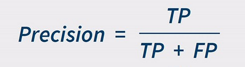
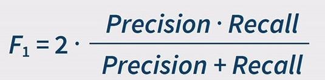
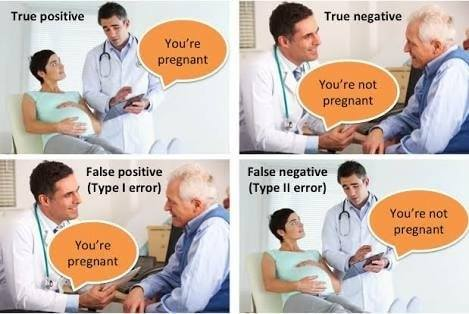

# Experimentation notebooks

Here you can find all the theory and explanation about the experimentation part of this project. 

Index

1. [Base-model BOW + Multinomial Naive Bayes](#Base-model-BOW-+-Multinomial-Naive-Bayes)
    - [Metrics used](#Metrics-used)
3. [Methods used](#Methods-used)

# Base-model BOW + Multinomial Naive Bayes 
[Notebook](https://github.com/AMaldu/spam_detector/blob/main/notebooks/experimentation/base_model_bow_MNB.ipynb)

**Bag of Words as Vectorizer**

***What is BOW?*** 
Bow is a technique that transforms text data into a set of tokens to feed the model. Here's how it works:

1. Tokenization: The text is split into individual words or tokens
2. Vocabulary Creation: All unique words (or tokens) from the entire text corpus are collected to form a vocabulary
3. Vector Representation: Each document is represented as a vector where each element corresponds to the presence or frequency of a word from the vocabulary

***Why BOW?*** 

1. BOW is simple to implement and understand
2. The semantic meaning of the e-mails is not that important because we are focusing on capturing keywords or phrases like  "free", "money", "offer", "limited time", "winner" and their frequencies can be indicative of spam or ham.
3. This is a vectorizer for the purpose of creating a base model. Let's keep it simple :)

**What is Multinomial Naive Bayes?**

The ***Multinomial Naive Bayes (MNB) model*** is a variant of the Naive Bayes algorithm that is particularly suited for classification tasks where the features are counts or frequencies of words in text data. It is called "multinomial" because it assumes that the features (typically word counts) follow a multinomial distribution like ours where the dependent variables are represented by the frequency of each word in the text data.

Naive Bayes classifiers are based on Bayes' Theorem and assume that the features are conditionally independent given the class and that makes this model have less tendency to overfit. While this assumption is often unrealistic in practice, it simplifies the computation, making Naive Bayes a very efficient algorithm.

The Multinomial Naive Bayes is particularly effective for problems where the features are word counts or frequency counts of events, such as in text classification problems.

**And why Multinomial?**

The dataset is going to be processed by a non-binary BOW (so we will get word frequencies) and this is a first approach I will leave other Naive Bayes algorithms for later. What could I use in the future? 

- Binary BOW + Bernoulli Naive Bayes, since it's suitable for working in the presence (1) or absence (0) or a word.

- Since my dataset is very imbalaced I can use BOW + Complement Naive Bayes that focuses more on the minority class.

## Metrics used

Our the dataset is very imbalanced with a 13.41% of SPAM so our metrics have to provide a clear vision of the model performance in the minority class.

**Precision** Out of all predicted positives, how many positives we got right?

  

A high precision value for the spam class indicates that most e-mails classified as spam by the model are actually spam.

**Recall** Out of all the real positives, how many positives we got right? 

  

A good recall for the spam class indicates that the model is identifying most of the spam emails.

**F1-score** Harmonic mean of precision and recall.

  

We have to make sure the F1-score is high.

**Confusion Matrix**

The confusion matrix shows the number of true positives, false positives, true negatives, and false negatives.

  

**Precision-Recall AUC**

It plots Precision-Recall plots that avoid the TNs rather focus on the performance of the minority class.

**Balanced Accuracy**

Balanced accuracy is the average of the recall for both classes. Great for imbalanced datasets because it gives equal weight to both classes.

**Weighted-averaged Precision/Recall/F1**

Useful when focusing on the minority-class metrics

**Why not other metrics?**

**Accuracy**

In an imbalanced dataset like ours where one class dominates (ham), a model can achieve high accuracy by mostly predicting the majority class. This is very important to remember.

**Error Rate**

Similar to accuracy, the error rate (1 - Accuracy) also mislead because it ignores the imbalace 

**ROC-AUC**

Since we have a very imbalanced dataset on the positive class, when creating the ROC-AUC plot, the FPR will be very small due to the huge amount of TNs that our model classifies. That will make the ROC curve look almost perfect (as if the model would be performing very good) but it's all a lie. It's better to use the Precision-Recall AUC plot.

**Macro-averaged Precision/Recall/F1**

They calculate the average of the metrix for each class without considering the size of the class leading to confusion.

Choosing precision, recall and f1-score is better because they focus on the model's performance of the minority class too.

